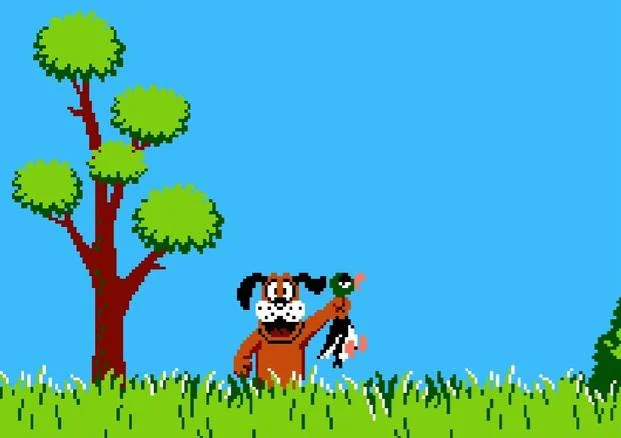

# Horizon Min — Teaching a VLM to Predict the Future and Shoot Fast



A vision-language model learns to play Duck Hunt from raw pixels — and discovers that **shooting sooner beats predicting further**.

The model outputs `shoot(x, y, horizon)` where `horizon` controls how many extra frames the game advances before the shot lands. A larger horizon gives more time to predict duck movement, but ducks bounce randomly off walls, so longer predictions accumulate more error. The training reward penalizes large horizons on hits, pushing the model to find the **minimum prediction window** needed for each shot. Hence the name — *horizon minimization*.

**60.9% hit rate** after GRPO training with Ministral (up from ~0% base model, ~5% random baseline).

> **[Trained Model (Ministral)](https://huggingface.co/dmayboroda/dh_ministal_gpro)** · Base: [Ministral-3-8B](https://huggingface.co/mistralai/Ministral-3-8B-Instruct-2512-BF16) (8.4B LLM + 0.4B Pixtral vision)

## Supported Models

| Model | Params | Tool-call format | VRAM (BF16) |
|-------|--------|------------------|-------------|
| [Ministral-3-8B](https://huggingface.co/mistralai/Ministral-3-8B-Instruct-2512-BF16) | 8.4B LLM + 0.4B Pixtral | `[TOOL_CALLS] [{"name":"shoot",...}]` | 24GB |
| [LFM2.5-VL-1.6B](https://huggingface.co/LiquidAI/LFM2.5-VL-1.6B) | 1.2B LFM + 400M SigLIP2 | `<\|tool_call_start\|>[shoot(...)]<\|tool_call_end\|>` | 8GB |

The model family is **auto-detected** from the config — one training script handles all models. See [training/README.md](training/README.md) for details.

## The Challenge

Duck Hunt is deceptively hard for an AI. Ducks move fast (7–11 px/frame at round 1, increasing each round), spawn from off-screen edges at random heights, bounce unpredictably off walls with speed jitter, and occasionally change direction mid-flight. The model must account for its own processing latency — the time between seeing frames and the shot actually landing. At 300ms latency (9 frames at 30 FPS), a duck traveling at 8 pixels/frame has moved 72 pixels by the time the bullet arrives. The model has to lead its shots.

The horizon tradeoff makes it harder still. The model can wait longer for a clearer trajectory — but every extra frame of prediction is a frame where the duck might bounce and invalidate the prediction. A model that masters this learns to adapt per-shot: short horizons for straight-flying ducks, longer ones near screen edges, and adjusted horizons across different latency conditions.

## How It Works

```
Game Frames (512x512) -> Vision Encoder -> LLM -> shoot(x, y, horizon)
                                                        |
                                        Environment simulates shot -> reward
                                                        |
                                                   GRPO update
```

The training pipeline uses **Group Relative Policy Optimization (GRPO)** — a reinforcement learning algorithm that samples multiple shot predictions for each game state, scores them against the environment, and updates the model toward better-rewarded outputs.

The action space is a single function call with three parameters:

| Parameter | Type | Range | Description |
|-----------|------|-------|-------------|
| `x` | float | 0.0–1.0 | Horizontal position (0=left, 1=right) |
| `y` | float | 0.0–1.0 | Vertical position (0=top, 1=bottom) |
| `horizon` | integer | 0–30 | Extra frames to wait before firing |

The total prediction distance is `processing_latency_frames + horizon`. The model must learn to lead its shots based on estimated duck velocity and the combined latency.

### Latency-Aware Training

The model is trained across multiple latency buckets, forcing it to generalize rather than memorize a single timing:

| Model | Latency range | Based on |
|-------|--------------|----------|
| Ministral | 100–600ms | Simulated range |
| LiquidAI | 50–600ms | Measured processing times (2 frames=100ms, 10 frames=200ms, 20 frames=300ms) |

A horizon penalty (`-0.1 * horizon/30`) on successful hits encourages the model to shoot quickly when it can.

### Reward Function

| Outcome | Reward |
|---------|--------|
| Hit one duck | +1.0 |
| Double kill | +2.5 |
| Miss | -0.3 |
| Shot dead/escaped duck | -0.7 |
| No target | -0.5 |
| Invalid output | -1.0 |
| Horizon penalty | -0.1 x (horizon / 30) on hits |

Two reward signals are combined: **accuracy** (did the shot hit?) and **format** (is the output a valid tool call?). See [training/REWARD.md](training/REWARD.md) for full documentation.

**Format reward with verbosity penalty**: The format reward scores output quality on a scale of 0.0–1.0. A clean tool call with no extra text gets 1.0. If the model generates explanations or filler around a valid tool call, the reward is penalized proportionally (down to a floor of 0.3). No parseable tool call at all gets 0.0.

**Proximity bonus (target-aware)**: On misses, a distance-based bonus gives gradient signal toward **flying** ducks only — aiming near a falling/dead duck gives no bonus. Uses exponential decay (`0.3 * exp(-5.0 * dist)`).

**Hotspot penalty**: Tracks recent shot positions. If the model repeatedly aims at the same spot, hits there get scaled-down rewards — going negative at >40% concentration. Prevents the model from exploiting a single "lucky" position.

**Curriculum training**: Two-phase approach — phase 1 (steps 0–2000) clamps horizon to 0 so the model focuses on learning (x, y) aiming. Phase 2 (steps 2000+) unlocks horizon for temporal prediction optimization.

**Anti-collapse measures**: Several mechanisms prevent the model from collapsing to a single fixed prediction:
- **Entropy bonus** (`-entropy_coeff * H`) in the GRPO loss keeps the policy stochastic
- **Entropy floor** — if entropy drops below a threshold, an extra penalty kicks in as an emergency brake
- **KL penalty** (`beta * KL(policy || reference)`) anchors the model to its original behavior
- **Randomized few-shot examples** — the few-shot values in the prompt change every step so the model can't memorize them
- **New match every step** — fresh ducks with random positions/speeds each training step

### Training Setup

The unified training script auto-detects the model family and applies the right tool-call format:

| | Ministral | LiquidAI (LoRA) | LiquidAI (Full) |
|---|-----------|-----------------|------------------|
| **LoRA targets** | q/k/v/o_proj | q/k/v/out_proj + in_proj + w1/w2/w3 | — |
| **Trainable params** | ~0.2% | ~1.5% | 100% |
| **Learning rate** | 5e-6 | 5e-6 | 5e-6 |
| **Generations per state** | 4 | 6 | 4 |
| **Tool format** | Mistral JSON | LiquidAI Pythonic | LiquidAI Pythonic |

**Input**: 4 observation frames (with configurable frame skip for visible duck displacement) + latency metadata

**Output**: Native tool calls in the model's format, directly servable via vLLM/SGLang with the OpenAI SDK

**Deterministic replay**: Game snapshots capture duck state + RNG seeds for reproducible reward computation

**W&B visualization**: Training logs observation frames with crosshair overlays showing where each generation predicted the shot, color-coded by generation with hit/miss labels.

## Quick Start

```bash
# Install uv if you haven't already
curl -LsSf https://astral.sh/uv/install.sh | sh

# Clone and install
cd horizon_min
uv sync --extra training
```

### Train

```bash
cd training

# Mistral with LoRA
./run_training.sh --config configs/ministral_config.yaml

# LiquidAI with LoRA
./run_training.sh --config configs/liquidai_config.yaml

# LiquidAI full fine-tune (no LoRA)
./run_training.sh --config configs/liquidai_nolora_config.yaml

# Custom GRPO loop (online environment interaction)
./run_training.sh --config configs/liquidai_config.yaml --custom

# Without W&B
./run_training.sh --config configs/liquidai_config.yaml --no-wandb

# Direct python (if deps already installed)
python train.py --config configs/liquidai_config.yaml --custom \
    --override training.max_steps=5000
```

### Evaluate

```bash
# Local evaluation (loads checkpoint directly)
python evaluate.py --config configs/liquidai_config.yaml \
    --checkpoint outputs/lfm25_duckhunt_grpo_v2/best_checkpoint \
    --baselines

# API-based evaluation (served model via vLLM/SGLang)
./serve_vlm.sh --model LiquidAI/LFM2.5-VL-1.6B
python eval_vlm.py --config configs/liquidai_eval.yaml
```

### Publish to Hugging Face Hub

```bash
./run_training.sh --config configs/liquidai_config.yaml --custom \
    --push-to-hub --hub-model-id username/duckhunt-lfm25-grpo
```

See [training/README.md](training/README.md) for full training documentation and [training/EVAL_VLM.md](training/EVAL_VLM.md) for API-based evaluation.

## Game Environment

A headless Duck Hunt implementation with no display required — pure Python API with PIL rendering.

| Parameter | Value |
|-----------|-------|
| Screen | 800 x 500 px |
| Model input | 512 x 512 px |
| FPS | 30 |
| Duck speed | 6 + round to 10 + round px/frame |
| Hitbox | 40 x 36 px (centered on 81x75 sprite) |
| Spawn | Off-screen left/right edge, random Y height |
| Mid-flight jitter | 3% chance/frame of direction nudge |
| Bounce speed jitter | +/-15% variation on wall bounce |
| Frame skip | 3 (observation frames spaced apart for visible displacement) |
| Match duration | 30s |
| Ducks per match | 2 |
| Bullets per match | 3 |
| Game over | 4 misses |
| Coordinates | 0.0–1.0 normalized |

### Running the Server

```bash
uv run uvicorn duck_hunt_openenv.server.app:app --reload --port 8000
```

### Serving a Trained Model

```bash
# Serve base model or fine-tuned checkpoint via vLLM
cd training
./serve_vlm.sh --model LiquidAI/LFM2.5-VL-1.6B
./serve_vlm.sh --checkpoint outputs/lfm25_duckhunt_grpo_v2/best

# SGLang backend
./serve_vlm.sh --model LiquidAI/LFM2.5-VL-1.6B --backend sglang

# Stop server
./serve_vlm.sh --stop
```

### Client Usage

```python
from duck_hunt_openenv.duck_hunt_env.client import DuckHuntEnv
from duck_hunt_openenv.duck_hunt_env.models import ShootAction

env = DuckHuntEnv.from_local(host="localhost", port=8000)
obs = env.reset()

while not obs.done:
    action = ShootAction(x=400, y=250, horizon=5)
    obs = env.step(action)
    print(f"Result: {obs.last_action_result}, Reward: {obs.reward}")

env.close()
```

## Project Structure

```
horizon_min/
├── duck_hunt_openenv/          # Game environment
│   ├── duck_hunt_env/          # Python client
│   ├── server/                 # Game engine + PIL renderer
│   │   ├── game_engine.py      # Duck physics, bouncing, hit detection
│   │   ├── environment.py      # OpenEnv wrapper, frame buffer, latency sim
│   │   ├── renderer.py         # Headless PIL rendering
│   │   └── config.py           # All game parameters
│   ├── experiments/            # VLM agent experiments
│   ├── tests/                  # Unit tests
│   └── assets/                 # Sprites, background, crosshairs
├── training/                   # GRPO training pipeline
│   ├── train.py                # Unified training entry point (all models)
│   ├── run_training.sh         # Unified launch script
│   ├── evaluate.py             # Local evaluation with baselines
│   ├── eval_vlm.py             # API-based VLM evaluation (served models)
│   ├── serve_vlm.sh            # Model serving via vLLM/SGLang
│   ├── configs/                # YAML configs (Ministral, LiquidAI, eval)
│   └── src/
│       ├── formats.py          # Model-specific: tool schemas, prompts, parsers
│       ├── utils.py            # Shared: Action, system prompt, format dispatch
│       ├── config.py           # Configuration dataclasses + YAML loading
│       ├── model.py            # Model/processor loading, LoRA setup
│       ├── environment.py      # Training environment wrapper
│       ├── reward.py           # Reward computation
│       ├── dataset.py          # Dataset generation, snapshots, reward functions
│       └── trainer.py          # Custom GRPO trainer + W&B crosshair visualization
├── demo/                       # HuggingFace Spaces demo
│   ├── app.py                  # Gradio UI + episode runner
│   └── assets/                 # Game assets
└── GAME_PARAMETERS.md          # Game mechanics reference
```

## Why This Matters

This demonstrates that small vision-language models can learn reactive, spatiotemporal reasoning from reinforcement learning alone — no human demonstrations, no reward shaping beyond hit/miss. The latency-aware design mirrors real-world deployment constraints where models must predict ahead to compensate for inference time.

## License

MIT
